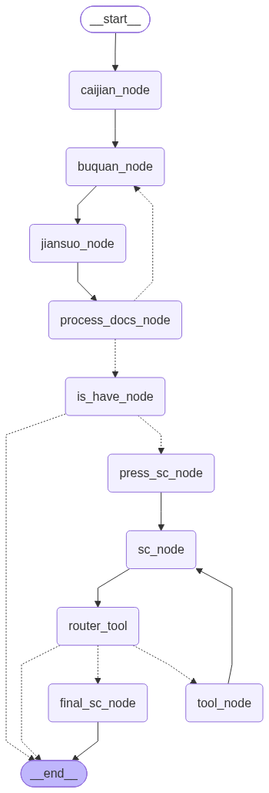

# 校园制度智能问答系统

基于 **LangGraph + RAG** 的校园制度问答助手，支持多轮对话、语义检索与工具调用。

## 📖 项目背景

校园制度文档条目多达上千条，学生查询时依赖关键词搜索，命中率低、理解成本高。
本项目通过 Milvus 向量语义检索 + PostgreSQL 条款存储 + 大模型生成 的方式，让学生用自然语言提问即可获得准确的制度条款回答。


✨ 核心功能
🔍 语义检索：Milvus 向量库负责召回相关条款

📚 条款正文存储：PostgreSQL 保存制度条款的完整正文，按需精确调取

🔄 查询改写与重试：检索效果差时自动改写问题，最多 3 次

🤖 ReAct 工具调用：模型可自主调用工具，从 PostgreSQL 查询详细条款

💬 多轮对话记忆：保留最近 3 轮真实用户提问，支持上下文追问

🛡️ 幻觉控制：检索不到时明确返回"查不到"，不编造

## 🏗️ 架构



### 工作流节点说明

| 节点 | 职责 |
|---|---|
| `caijian_node` | 裁剪对话历史，保留最近 3 轮真实提问 |
| `buquan_node` | 补全/改写用户问题，使其独立完整 |
| `jiansuo_node` | Milvus 向量检索，召回相关文档 |
| `process_docs_node` | 去重、分数过滤、截断 |
| `is_have_node` | 判断是否有检索结果 |
| `press_sc_node` | 拼接 RAG 上下文与提示词 |
| `sc_node` | 调用主模型生成回答（可触发工具调用） |
| `tool_node` | 执行工具调用（查询详细条款） |
| `final_sc_node` | 工具调用超限时，用无工具模型兜底总结 |

## 🛠️ 技术栈

- **框架**：LangGraph / LangChain
- **向量库**：Milvus
- **大模型**：DeepSeek / Ollama（本地）
- **Embedding**：通义千问 Embedding
- **数据库**：PostgreSQL（条款详情）
- **语言**：Python 3.10+

## 🚀 快速开始

### 1. 环境准备

```bash
# 创建虚拟环境
conda create -n langgraph python=3.10
conda activate langgraph

# 安装依赖
pip install -r requirements.txt
```

### 2. 启动 Milvus

```bash
docker run -d --name milvus-standalone \
  -p 19530:19530 -p 9091:9091 \
  milvusdb/milvus:v2.4.0 standalone
```

### 3. 配置环境变量

复制 `.env.example` 为 `.env`，填入你自己的配置：

```bash
cp .env.example .env
# 编辑 .env，填入 API Key、数据库连接信息
```

### 4. 灌数据

```bash
python scripts/ingest.py
```

### 5. 运行

```python
from langchain_core.messages import HumanMessage
from langgraph.checkpoint.memory import InMemorySaver
from study.graph import builder

graph = builder.compile(checkpointer=InMemorySaver())
config = {"configurable": {"thread_id": "test"}}

for chunk in graph.stream(
    {
        "messages": [HumanMessage(content="如何办理转学？")],
        "original_question": "如何办理转学？",
    },
    config=config,
    stream_mode=["updates", "custom"],
):
    print(chunk)
```

## 📁 项目结构

```
study/
├── study/                  # 主包
│   ├── graph.py            # 工作流编排
│   ├── state.py            # 状态定义
│   ├── prompt.py           # 提示词模板
│   ├── db/                 # 数据层（Milvus、模型）
│   ├── nodes/              # 工作流节点
│   │   ├── preprocess.py   # 预处理（裁剪、改写）
│   │   ├── retrieval.py    # 检索（搜索、过滤）
│   │   ├── generate.py     # 生成（RAG、模型调用）
│   │   └── router.py       # 条件路由
│   └── tool/               # 工具定义
├── scripts/                # 一次性脚本（灌数据、调试）
├── docs/                   # 文档与架构图
└── requirements.txt
```

## 🎯 关键设计

### 切分逻辑
学生手册有天然的四级结构：**块 → 章 → 条 → 款**。
切分就按这个结构走，而不是用通用文本切分器硬切——硬切会把
"第X条"拦腰截断，正文和上下文一起报废。

切分结果是"**结构进 SQL、向量进 Milvus、id 做对齐**"：

| 单元 | 存哪 | 用途 |
|---|---|---|
| **条** | 正文进 PostgreSQL，向量进 Milvus | 主力检索单元，一个 `clause_id` 两边共用 |
| **款** | 进 PostgreSQL | 条下的细分内容，按 `clause_id` 精确召回 |
| **章** | 整章进 PostgreSQL，向量进 Milvus | 应对"这一章讲了什么"这类概览型问题 |

两个关键点：

- **`clause_id` 是 SQL 与 Milvus 对齐的唯一钥匙**。向量命中后凭
  这个 id 回 SQL 取正文，不会张冠李戴。
- **章级内容也走向量 + 工具召回**。学生问"第三章整体讲了什么"时，
  条级检索召不回整章，必须单独为章建一条向量入口。

### 1. 查询改写 + 重试循环

当检索结果不足（< 3 条）时，自动改写问题重新检索，最多 3 次。
避免因用户提问模糊导致的检索失败。

### 2. 对话历史裁剪

按 `HumanMessage` 计数而非按位置裁剪，保留最近 3 轮真实用户提问。
避免 RAG 注入的临时消息污染裁剪逻辑。

> 不做长期记忆：本场景属于科普型问答，多轮上下文依赖弱，
> 记忆越长越容易把无关历史带进 prompt，反而诱发幻觉。

### 3. 工具调用限制

通过 `tool_used` 标记限制单轮对话最多调用一次工具，
防止模型无限循环调用。

### 4. RAG 与工具的分工

- **RAG**：快速定位相关条款位置
- **工具**：按需查询详细条款正文
两者结合，兼顾响应速度与回答完整性。

## 📊 效果

- 覆盖 **1247 条** 校园制度条目
- 检索召回率：**XX%**（待补测）
- 平均响应时间：**XX 秒**（待补测）

## 🔮 后续优化方向

- [ ] 接入 LangSmith 做链路追踪与评估
- [ ] 补充单元测试与集成测试
- [ ] 引入重排序（Rerank）提升召回质量
- [ ] 加入 FastAPI 接口，支持前端调用

## 📄 License

MIT

## 👤 作者

[王晨阳] · [3107485668@qq.com] · [你的博客/GitHub]